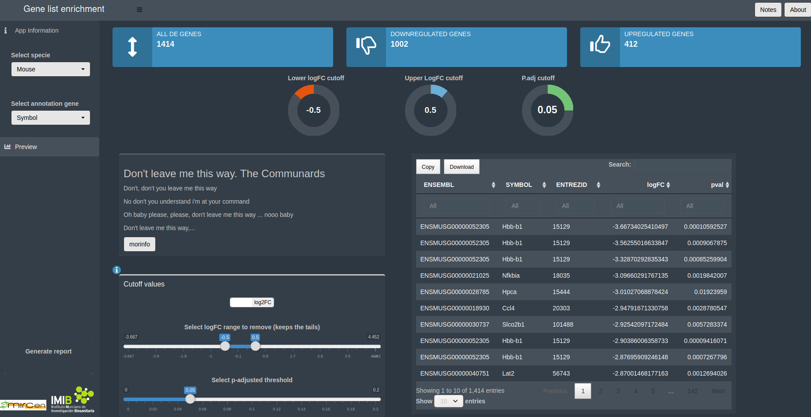
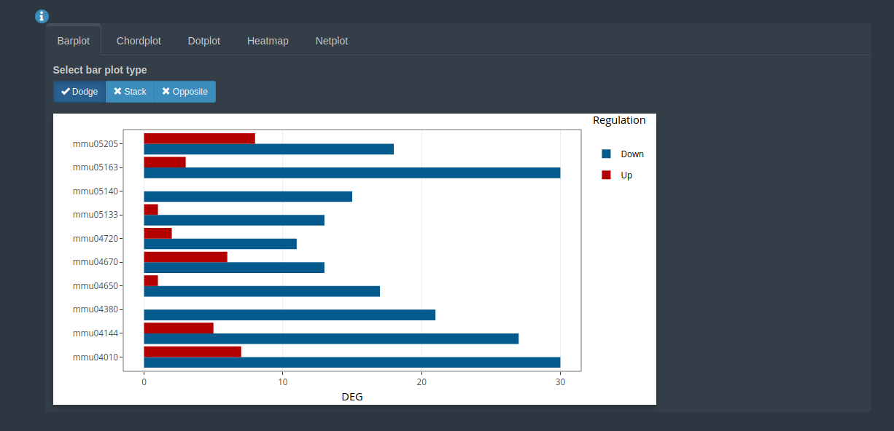

## Presentación en pruebas

Pues eso, que le das al botón preview y sale esto

## otra cosa

<video width="680" height="420" loop controls>
<source src="output.webm" type="video/webm">
</video>

## Volcano plot

El volcano plot es pechiocho

## kegg

Y cuando le das a enrich, salen un montón de cosicas

